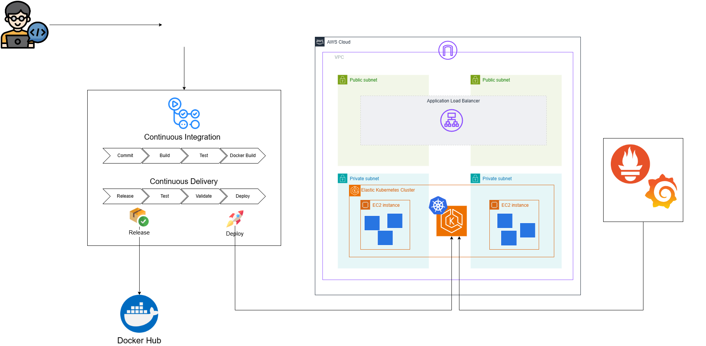

# Projeto Fake Shop
## Objetivo
O objetivo do projeto é ser um pequeno e-commerce para ser usado como prova de conceito para o processo de deploy de uma aplicação em ambiente Kubernetes com pipeline CI/CD e monitoramento.

## Premissas do Projeto
Para o desenvolvimento do projeto, segui as seguintes premissas:
- Utilizar containers Docker para facilitar o deploy no Kubernetes
- O deploy da aplicação vai ser feito em um cluster na AWS com Elastic Kubernetes Service
- Todo o processo de criação de release da aplicação e deploy no Kubernetes deve ser feito de forma automatica
- A aplicação e o cluster Kubernetes devem ser monitorados 

## Tecnologias relacionadas
- [Python](https://www.python.org/)
- [Flask](https://flask.palletsprojects.com/)
- [Docker](https://www.docker.com/)
- [Kubernetes](https://kubernetes.io/)
- [AWS](https://aws.amazon.com/pt/eks/)
- [Prometheus](https://prometheus.io/)
- [Grafana](https://grafana.com/grafana/)

## Configuração da Aplicação

A configuração da aplicação é feita usando variáveis de ambiente na aplicação e no banco de dados.

### Variáveis de Ambiente do PortgreSQL

As variáveis de ambiente do Postgre são detalhadas no Docker Hub:

https://hub.docker.com/_/postgres

### Variável de Ambiente da aplicação

DB_HOST => Host do banco de dados PostgreSQL.

DB_USER => Nome do usuário do banco de dados PostgreSQL.

DB_PASSWORD => Senha do usuário do banco de dados PostgreSQL.

DB_NAME => Nome do banco de dados PostgreSQL.

DB_PORT => Porta de conexão com o banco de dados PostgreSQL.

### Pegar password grafana da aplicação
´´´
kubectl get secret --namespace default grafana -o jsonpath="{.data.admin-password}" | base64 --decode ; echo
´´´

# Estrutura da aplicação

Esse é o diagrama do projeto de pipeline e monitoramento:

-----------------------------------------------------------------------------------------------------------------

-----------------------------------------------------------------------------------------------------------------

Automatizando o Deploy de uma Aplicação Web com Pipeline CI/CD, Docker, AWS EKS e Monitoramento com Grafana e Prometheus

Hoje, estou compartilhando uma projeto devops incrivel sobre como transformar uma aplicação web existente em uma solução escalável e automatizada usando as melhores práticas de DevOps e Cloud Computing.

 O Processo:

1. Containerizando a Aplicação
 
 - A primeira etapa foi criar um Dockerfile para containerizar a aplicação. Isso nos permite executar a aplicação de forma independente, garantindo consistência entre os diferentes ambientes de desenvolvimento, teste e produção.
 
2. Criando um Cluster EKS na AWS
 
 - Para facilitar a escalabilidade e gerenciamento, subi a aplicação em um Cluster EKS (Elastic Kubernetes Service). O Kubernetes gerencia a aplicação e garante que ela esteja sempre disponível, até mesmo em caso de falhas.
 
3. Automatizando o Pipeline com GitHub Actions
 
 - Integrando o GitHub Actions, criamos um pipeline de CI/CD que automatiza o deploy da aplicação diretamente no Amazon EKS, utilizando manifestos do Kubernetes. Dessa forma, o processo de deploy é simplificado, economizando tempo e reduzindo erros humanos.
 

4. Monitoramento com Prometheus e Grafana
 
 - Para garantir que nossa aplicação esteja sempre rodando de forma eficiente, integramos o prometheus para coletar métricas e o grafana para visualização. Com isso, é possível monitorar em tempo real o desempenho da aplicação, identificar gargalos e responder rapidamente a possíveis problemas.

Este processo não só aumentou a confiabilidade e escalabilidade da aplicação, mas também melhorou significativamente a velocidade do ciclo de desenvolvimento, além de permitir uma observabilidade mais precisa e contínua.

Realização do desafio feito pelo Fabricio Veronez na Formação DevOps Pro

Obrigada por essas aulas, baita reforço de conhecimento.

Link do repositório: https://lnkd.in/d3ZFHvwk

hashtag#DevOps hashtag#AWS hashtag#EKS hashtag#Kubernetes hashtag#CI_CD hashtag#GitHubActions hashtag#Docker hashtag#Prometheus hashtag#Grafana hashtag#Monitoramento hashtag#CloudComputing hashtag#Automação hashtag#DesafioDevopsPro